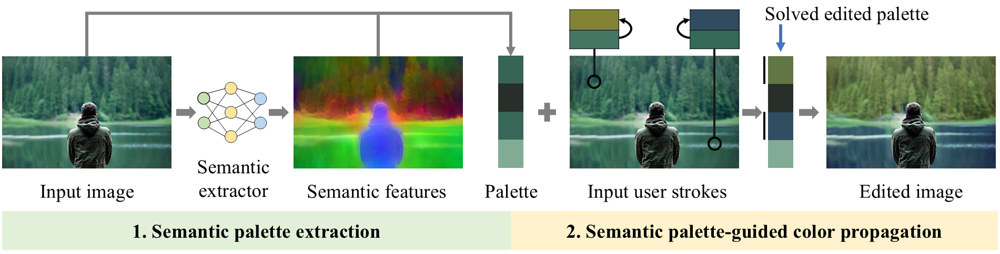
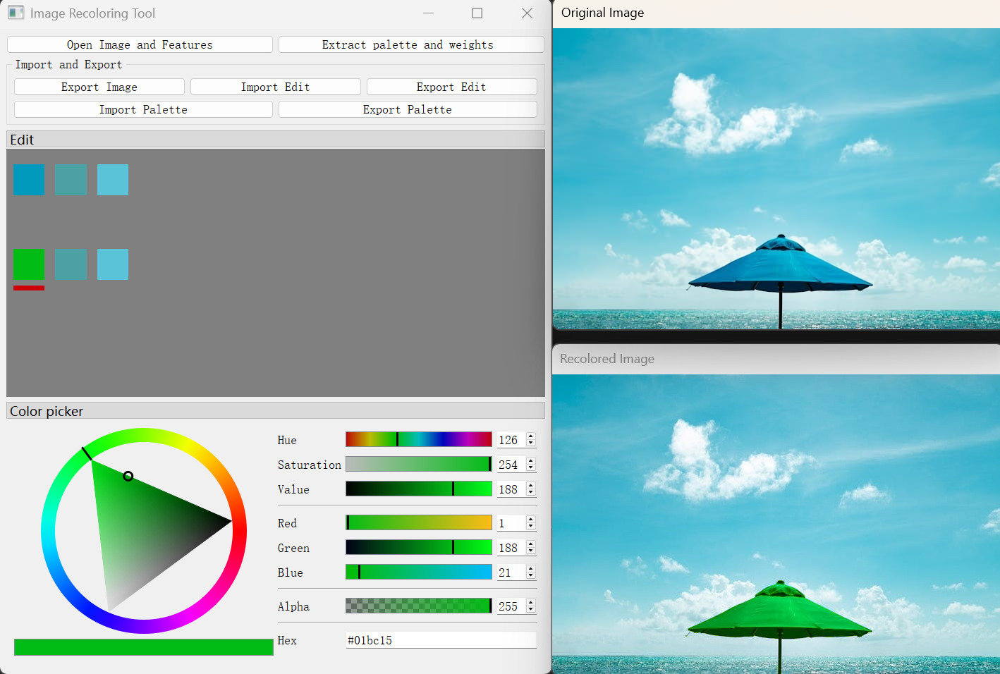

## Semantic Palette-Guided Color Propagation

Here is the source code of the paper "Semantic Palette-Guided Color Propagation".

## Requirements

1. OS: Windows 11
2. Qt: 5.12.9
3. OpenCV: 4.9.0
4. OpenGL
5. NLopt
6. IDE: Visual Studio 2022

## Usage

We based Zhengjun Du's code (https://github.com/Zhengjun-Du/Convexhull-based-Image-Recoloring-GUI) to build a GUI. 

1. Click **RgbPalette_Recolor_GUI.sln** to compile the source code
2. Click the button **Open Image and Features** to load the input image and semantic features respectively, then the original and recolored images will be shown on the right
3. Fill the palette size and Click the button **Extract palette and weights** to extract the color palette of the input image and calculate the weights
4. Left-click on the area users want to recolor, and the corresponding pixels will be shown in real time in the **Edit** area on the left
5. Modify the color(s) in the **Edit** area

## Semantic features extraction

1. We follow Yagiz Aksoy's code to extract the semantic features, please refer to https://github.com/iyah4888/SIGGRAPH18SSS, replace the main_hyper.py with **Extract_Semantic/SemanticExtractor.py** and add the file **Extract_Semantic/save_features.py** into it
2.  Run **SemanticExtractor.py** to extract the semantic feature of an input image

## Contact info

* Email: cello_ziyuzhang@163.com

  
